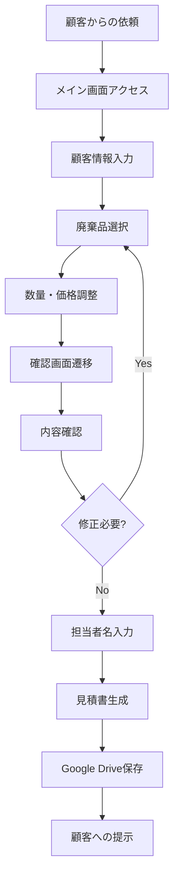
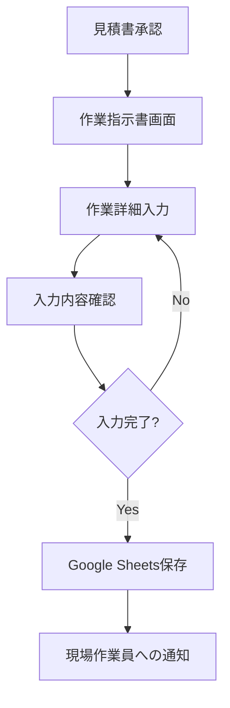

# 廃棄品見積もりシステム 詳細仕様書

## 文書管理情報
- **作成日**: 2025年6月24日
- **最終更新日**: 2025年7月18日
- **バージョン**: 2.0
- **作成者**: 相曽 結

---

## 目次
1. [はじめに](#1-はじめに)
2. [システム概要](#2-システム概要)
3. [機能要件](#3-機能要件)
4. [非機能要件](#4-非機能要件)
5. [システム設計](#5-システム設計)
6. [データベース設計](#6-データベース設計)
7. [外部インターフェース](#7-外部インターフェース)
8. [セキュリティ要件](#8-セキュリティ要件)
9. [テスト要件](#9-テスト要件)
10. [運用要件](#10-運用要件)
11. [制約事項](#11-制約事項)
12. [用語集](#12-用語集)

---

## 1. はじめに

### 1.1 文書の目的
本文書は、廃棄品見積もりシステムの開発における詳細な機能要件、非機能要件、システム設計を定義することを目的とします。

### 1.2 適用範囲
本仕様書は、廃棄品見積もりシステムの設計、開発、テスト、導入に関わる全ての工程に適用されます。

### 1.3 参照文書
- システム概要書（abstract.md）
- 既存業務フロー調査書
- Google Drive見積書テンプレート
- Google Spreadsheet作業指示書テンプレート
- LocalStorage削減計画書（plan.md）

### 1.4 前提条件
- Google Workspace環境の利用が可能であること
- Next.js 15.x以上の開発環境が整備されていること
- 対象ユーザーがWebブラウザの基本操作を理解していること

---

## 2. システム概要

### 2.1 システムの目的
廃棄品処理業務における見積もり作成から作業指示書生成までの業務プロセスをデジタル化し、以下の目標を実現します：

- **業務効率化**: 見積書作成時間を30分から10分に短縮（67%削減）
- **品質向上**: 標準化されたフォーマットによる一貫性確保
- **ヒューマンエラー削減**: 手作業による入力ミスを80%削減
- **顧客満足度向上**: 迅速な見積もり提供による競争力強化

### 2.2 システムの位置づけ
本システムは、廃棄品処理業者の基幹業務を支援するWebアプリケーションとして位置づけられます。既存の業務フローを維持しつつ、デジタル化による効率化を図ります。

### 2.3 対象ユーザー
| ユーザー種別 | 人数 | 主な利用機能 | 利用頻度 |
|-------------|------|-------------|----------|
| 営業担当者 | 3名 | 見積書作成、顧客情報管理 | 日常的（1日10-15件） |
| 事務担当者 | 2名 | 作業指示書作成、データ管理 | 日常的（1日5-10件） |
| 現場作業員 | 8名 | 作業指示書確認 | 必要時（週2-3回） |
| 管理者 | 1名 | システム管理、データ監視 | 定期的（週1-2回） |

### 2.4 システム構成概要
```
[フロントエンド]
Next.js + TypeScript + Tailwind CSS
         ↓
[外部API連携]
Google Drive API ← 見積書PDF保存
Google Sheets API ← 作業指示書データ保存
         ↓
[データ管理]
React Context API（状態管理）
LocalStorage（顧客情報のみ永続化）
Google Drive（見積書PDF）
Google Spreadsheet（作業指示書）
```

---

## 3. 機能要件

### 3.1 機能一覧
| 機能ID | 機能名 | 優先度 | 概要 |
|--------|--------|--------|------|
| F001 | 顧客情報管理 | 高 | 顧客基本情報の入力・編集・表示 |
| F002 | 廃棄品選択 | 高 | カテゴリ別・検索による商品選択 |
| F003 | 見積書生成 | 高 | PDF形式の見積書自動生成 |
| F004 | 作業指示書作成 | 高 | 作業詳細情報の入力・管理 |
| F005 | 外部連携 | 高 | Google Drive・Sheets連携 |
| F006 | 画像管理 | 中 | 廃棄品画像の添付・表示 |
| F007 | 価格調整 | 中 | 個別価格の調整機能 |
| F008 | データ検索 | 低 | 過去データの検索・参照 |
| F009 | 状態管理 | 高 | React Context APIによる一元管理 |
| F010 | 税額計算 | 高 | 税込額から税抜額の自動計算 |

### 3.2 画面構成

#### 3.2.1 メイン画面（見積もり作成）
**画面ID**: SC001  
**画面名**: 見積もり作成画面  
**アクセス権**: 営業担当者、事務担当者

**レイアウト構成**:
```
┌─────────────────────────────────────┐
│ ヘッダー（タイトル・ナビゲーション）  │
├─────────────────────────────────────┤
│ ┌─────────┐ ┌─────────┐ ┌─────────┐ │
│ │顧客情報  │ │廃棄品選択│ │選択済み  │ │
│ │入力エリア│ │エリア    │ │アイテム  │ │
│ │         │ │         │ │・合計金額│ │
│ └─────────┘ └─────────┘ └─────────┘ │
├─────────────────────────────────────┤
│ フッター（確認画面へ遷移ボタン）      │
└─────────────────────────────────────┘
```

**入力項目**:
| 項目名 | 型 | 必須 | 制約 | 初期値 |
|--------|----|----|------|--------|
| 顧客名 | 文字列 | ○ | 50文字以内 | - |
| 住所 | 文字列 | ○ | 200文字以内 | - |
| 電話番号 | 文字列 | ○ | ハイフン含む15文字以内 | - |
| メールアドレス | 文字列 | ○ | RFC準拠 | - |
| 廃棄予定日 | 日付 | ○ | 本日以降 | 本日+7日 |

**廃棄品選択方法**:
1. **カテゴリ別選択**
   - 椅子・ソファ
   - 机・テーブル
   - タンス・収納家具
   - 家電製品
   - ベッド・寝具
   - その他

2. **五十音別選択**
   - あ行 ～ わ行（10タブ）

3. **検索機能**
   - 商品名による部分一致検索
   - リアルタイム絞り込み

#### 3.2.2 確認画面（見積もり確認）
**画面ID**: SC002  
**画面名**: 見積もり確認画面  
**アクセス権**: 営業担当者、事務担当者

**機能**:
- 入力内容の確認表示
- 担当者名入力
- 見積書PDF生成
- Google Drive自動保存
- 作業指示書画面への遷移

**見積書出力項目**:
```
┌─────────────────────────┐
│ 株式会社○○ 見積書       │
├─────────────────────────┤
│ お客様情報              │
│ - 顧客名               │
│ - 住所                 │
│ - 電話番号             │
│ - 廃棄予定日           │
├─────────────────────────┤
│ 廃棄品明細              │
│ No. 品名 数量 単価 金額 │
│ 1.  ○○  1   1000  1000 │
│ ...                    │
├─────────────────────────┤
│ 合計金額: ○○○円        │
│ 担当者: ○○            │
│ 作成日: 2025/06/24     │
└─────────────────────────┘
```

#### 3.2.3 作業指示書画面
**画面ID**: SC003  
**画面名**: 作業指示書作成画面  
**アクセス権**: 事務担当者、管理者

**入力項目**:
| 項目名 | 型 | 必須 | 制約 | 備考 |
|--------|----|----|------|------|
| 収集日時 | 日時 | ○ | - | - |
| 備考 | 文字列 | △ | 500文字以内 | - |
| 作業伝票 | 真偽値 | ○ | - | 必要/不要 |
| 計量 | 真偽値 | ○ | - | 必要/不要 |
| マニフェスト | 真偽値 | ○ | - | 必要/不要 |
| リサイクル券 | 真偽値 | ○ | - | 必要/不要 |
| 集金額（税込） | 数値 | ○ | 0以上 | 円単位 |
| 集金額（税抜） | 数値 | ○ | 0以上 | 税込額から自動計算 |
| Tポイント使用 | 真偽値 | ○ | - | 有/無 |
| Tポイント使用数 | 数値 | △ | 0以上 | ポイント単位 |

### 3.3 業務フロー

#### 3.3.1 見積もり作成フロー


#### 3.3.2 作業指示書作成フロー


---

## 4. 非機能要件

### 4.1 性能要件
| 項目 | 要件 | 測定方法 |
|------|------|----------|
| 応答時間 | 画面遷移3秒以内 | ブラウザ開発者ツール |
| 同時利用者数 | 最大20名 | 負荷テスト |
| データ処理量 | 1日最大100件の見積もり | 実運用測定 |
| ファイルサイズ | 見積書PDF 1MB以内 | ファイル容量確認 |

### 4.2 可用性要件
- **稼働率**: 営業時間内（9:00-18:00）99.5%以上
- **保守時間**: 営業時間外での定期メンテナンス
- **障害復旧**: 4時間以内の復旧対応

### 4.3 互換性要件
**対応ブラウザ**:
- Chrome 100以降
- Firefox 100以降
- Safari 15以降
- Edge 100以降

**対応デバイス**:
- デスクトップPC（Windows/Mac）
- タブレット（iPad/Android）
- スマートフォン（iOS/Android）

### 4.4 拡張性要件
- 月間処理件数1,000件まで対応
- ユーザー数50名まで拡張可能
- 商品マスタ10,000件まで対応

---

## 5. システム設計

### 5.1 システム構成図
```
┌─────────────────────────────────────┐
│            フロントエンド            │
│  Next.js + TypeScript + Tailwind   │
│  ┌─────────┐ ┌─────────┐ ┌────────┐ │
│  │画面表示  │ │状態管理  │ │API通信 │ │
│  │コンポーネ│ │(React   │ │モジュー│ │
│  │ント     │ │ Hooks)  │ │ル     │ │
│  └─────────┘ └─────────┘ └────────┘ │
└─────────────────────────────────────┘
                    │
                    ▼
┌─────────────────────────────────────┐
│            外部API連携              │
│  ┌─────────────┐ ┌─────────────┐    │
│  │Google Drive │ │Google Sheets│    │
│  │API          │ │API          │    │
│  │(見積書PDF)  │ │(作業指示書) │    │
│  └─────────────┘ └─────────────┘    │
└─────────────────────────────────────┘
                    │
                    ▼
┌─────────────────────────────────────┐
│            データ保存               │
│  ┌─────────────┐ ┌─────────────┐    │
│  │Google Drive │ │Google       │    │
│  │フォルダ     │ │Spreadsheet  │    │
│  │/estimates/  │ │/work-orders/│    │
│  └─────────────┘ └─────────────┘    │
└─────────────────────────────────────┘
```

### 5.2 アプリケーション構成
```
src/
├── app/                    # Next.js App Router
│   ├── page.tsx           # メイン画面
│   ├── confirmation/      # 確認画面
│   └── instructions/      # 作業指示書画面
├── components/            # 共通コンポーネント
│   ├── ui/               # UIコンポーネント
│   ├── forms/            # フォームコンポーネント
│   └── layouts/          # レイアウトコンポーネント
├── contexts/              # React Context API
│   ├── AppContext.tsx    # アプリケーション状態管理
│   ├── AppReducer.ts     # Reducerロジック
│   └── types.ts          # 状態管理型定義
├── lib/                  # ユーティリティ
│   ├── api/              # API通信
│   ├── types/            # 型定義
│   ├── validation/       # バリデーション（Zod）
│   └── utils/            # 汎用関数
├── hooks/                # カスタムフック
└── styles/               # スタイル定義
```

### 5.3 状態管理設計

#### 5.3.1 React Context APIによる状態管理
本システムでは、LocalStorage依存を最小化し、React Context APIとuseReducerを使用した状態管理を実装しています。

```typescript
// グローバル状態の型定義
interface AppState {
  selectedItems: SelectedItem[];
  customerInfo: CustomerInfo;
  totalAmount: number;
  collectionDate: string;
  notes: string;
  quoteGenerated: boolean;
  instructionsSaved: boolean;
  workSlip: boolean;
  weighing: boolean;
  manifest: boolean;
  recycleTicket: boolean;
  collectionAmountTaxIncluded: number;
  collectionAmountTaxExcluded: number;
  vPointAvailable: boolean;
  vPointUsage: number;
}

// 顧客情報の型定義
interface CustomerInfo {
  name: string;
  address: string;
  phone: string;
  email: string;
  disposalDate: string;
  assignedStaff?: string;
}

// 選択アイテムの型定義
interface SelectedItem {
  id: string;
  name: string;
  category: string;
  quantity: number;
  unitPrice: number;
  totalPrice: number;
  customPrice?: number;
  imageUrl?: string;
  notes?: string;
}

// 作業指示書情報の型定義
interface InstructionsInfo {
  collectionDate: string;
  notes: string;
  workSlip: boolean;              // 作業伝票
  weighing: boolean;              // 計量
  manifest: boolean;              // マニフェスト
  recycleTicket: boolean;         // リサイクル券
  collectionAmountTaxIncluded: number;    // 集金額（税込）
  collectionAmountTaxExcluded: number;    // 集金額（税抜）
  vPointAvailable: boolean;       // Vポイント
  vPointUsage: number;           // 使用するポイント数
}
```

#### 5.3.2 バリデーション設計
```typescript
// Zodを使用したバリデーションスキーマ
export const instructionsSchema = z.object({
  collectionDate: z.string().min(1, '収集日は必須です'),
  notes: z.string().optional(),
  workSlip: z.boolean(),
  weighing: z.boolean(),
  manifest: z.boolean(),
  recycleTicket: z.boolean(),
  collectionAmountTaxIncluded: z.number().min(0, '集金額（税込）は0以上である必要があります'),
  collectionAmountTaxExcluded: z.number().min(0, '集金額（税抜）は0以上である必要があります'),
  vPointAvailable: z.boolean(),
  vPointUsage: z.number().min(0, 'Vポイント使用数は0以上である必要があります'),
})
```

---

## 6. データベース設計

### 6.1 データ保存方針
本システムでは、運用コスト削減と導入の簡素化を目的として、従来のデータベースを使用せず、以下の方式でデータを管理します：

**一時データ**: React Context API（アプリケーション内状態管理）
**永続データ**: 
- LocalStorage（顧客情報のみ）
- Google Drive（見積書PDF）
- Google Spreadsheet（作業指示書）

#### 6.1.1 LocalStorage使用の最小化
- 従来: 13箇所でLocalStorageを使用
- 現在: 2箇所のみ（顧客情報の永続化）
- 効果: パフォーマンス向上とデータ整合性の改善

### 6.2 商品マスタ管理
商品マスタは以下の2つの方式から選択可能です：

#### 6.2.1 方式A: Firestore使用
```typescript
// Firestore商品マスタ構造
interface ProductMaster {
  id: string;
  name: string;
  category: string;
  basePrice: number;
  initial: string;
  description?: string;
  imageUrl?: string;
  isActive: boolean;
  createdAt: Timestamp;
  updatedAt: Timestamp;
}
```

**メリット**:
- データの整合性が高い
- 高速な検索・絞り込みが可能
- セキュリティが確保される

**デメリット**:
- 価格変更時の手間
- 運用コストが発生

#### 6.2.2 方式B: Google Spreadsheet使用
```
商品マスタシート構造:
| A列:ID | B列:商品名 | C列:カテゴリ | D列:基本価格 | E列:五十音 | F列:備考 |
|--------|-----------|-------------|-------------|----------|--------|
| P001   | 事務椅子   | 椅子        | 1000        | あ       | -      |
| P002   | ダイニングテーブル | 机・テーブル | 3000 | た | - |
```

**メリット**:
- 価格変更が容易
- 非技術者でも管理可能
- 初期導入コストが低い

**デメリット**:
- データ整合性の管理が必要
- 大量データでの性能劣化

### 6.3 ファイル管理構造

#### 6.3.1 Google Drive構造
```
/廃棄品見積もりシステム/
├── /見積書/
│   ├── /2025/
│   │   ├── /01月/
│   │   │   ├── 見積書_20250115_001_田中様.pdf
│   │   │   └── 見積書_20250116_002_佐藤様.pdf
│   │   └── /02月/
│   └── /テンプレート/
│       └── 見積書テンプレート.xlsx
└── /作業指示書/
    └── /テンプレート/
        └── 作業指示書テンプレート.xlsx
```

#### 6.3.2 Google Spreadsheet構造
**作業指示書管理シート**:
| 列 | 項目名 | 型 | 備考 |
|----|--------|----|----|
| A | 作成日時 | 日時 | 自動入力 |
| B | 顧客名 | 文字列 | - |
| C | 収集日時 | 日時 | - |
| D | 作業伝票 | 真偽値 | 必要/不要 |
| E | 計量 | 真偽値 | 必要/不要 |
| F | マニフェスト | 真偽値 | 必要/不要 |
| G | リサイクル券 | 真偽値 | 必要/不要 |
| H | 集金額（税込） | 数値 | 円 |
| I | 集金額（税抜） | 数値 | 円 |
| J | Tポイント使用 | 真偽値 | 有/無 |
| K | Tポイント使用数 | 数値 | - |
| L | 担当者 | 文字列 | - |
| M | 備考 | 文字列 | - |

---

## 7. 外部インターフェース

### 7.1 Google Drive API連携

#### 7.1.1 認証方式
- **OAuth 2.0**を使用したサービスアカウント認証
- APIキーは環境変数で管理
- スコープ: `https://www.googleapis.com/auth/drive.file`

#### 7.1.2 API仕様
**ファイルアップロード**:
```javascript
// 見積書PDFアップロード
const uploadEstimate = async (pdfBlob, filename) => {
  const metadata = {
    name: filename,
    parents: [ESTIMATES_FOLDER_ID]
  };
  
  const media = {
    mimeType: 'application/pdf',
    body: pdfBlob
  };
  
  return await gapi.client.drive.files.create({
    resource: metadata,
    media: media
  });
};
```

### 7.2 Google Sheets API連携

#### 7.2.1 データ書き込み仕様
```javascript
// 作業指示書データ追加
const addWorkOrder = async (workOrderData) => {
  const values = [
    [
      new Date().toISOString(),
      workOrderData.customerName,
      workOrderData.collectionDate,
      workOrderData.workSlip ? '必要' : '不要',
      workOrderData.weighing ? '必要' : '不要',
      workOrderData.manifest ? '必要' : '不要',
      workOrderData.recycleTicket ? '必要' : '不要',
      workOrderData.collectionAmountTaxIncluded,
      workOrderData.collectionAmountTaxExcluded,
      workOrderData.vPointAvailable ? '有' : '無',
      workOrderData.vPointUsage,
      workOrderData.assignedStaff,
      workOrderData.notes
    ]
  ];
  
  return await gapi.client.sheets.spreadsheets.values.append({
    spreadsheetId: WORK_ORDER_SHEET_ID,
    range: 'Sheet1!A:M',
    valueInputOption: 'RAW',
    resource: { values }
  });
};
```

### 7.3 エラーハンドリング
| エラー種別 | HTTPステータス | 対応方法 |
|-----------|---------------|----------|
| 認証エラー | 401 | 再認証フローの実行 |
| 権限エラー | 403 | エラーメッセージ表示 |
| 容量超過 | 413 | ファイルサイズ確認・圧縮 |
| ネットワークエラー | 500+ | リトライ処理（最大3回） |

---

## 8. セキュリティ要件

### 8.1 データ保護
- 顧客情報は必要最小限のみLocalStorageに保存
- APIキーは環境変数で管理
- HTTPSによる通信の暗号化

### 8.2 アクセス制御
- Google OAuth 2.0による認証
- 適切なスコープ設定による権限管理

## 9. テスト要件

### 9.1 単体テスト
- コンポーネントテスト（React Testing Library）
- バリデーションテスト（Zod）
- Reducer関数テスト

### 9.2 統合テスト
- フォーム入力から見積書生成までのE2Eテスト
- 税額自動計算機能のテスト
- Context API状態管理のテスト

## 10. 運用要件

### 10.1 監視項目
- アプリケーション稼働状況
- Google API利用状況
- エラー発生率

### 10.2 バックアップ
- Google Drive/Sheetsによる自動バックアップ
- 定期的なデータエクスポート

## 11. 制約事項

### 11.1 技術的制約
- ブラウザのLocalStorage容量制限（約5MB）
- Google API利用制限
- 税率は10%固定（変更時はコード修正必要）

### 11.2 運用制約
- インターネット接続が必須
- Google Workspaceアカウントが必要

## 12. 用語集

| 用語 | 説明 |
|------|------|
| Context API | Reactの状態管理機能 |
| LocalStorage | ブラウザのローカルストレージ |
| Zod | TypeScript向けバリデーションライブラリ |
| TanStack Form | フォーム状態管理ライブラリ |
| 税込額 | 消費税を含む金額 |
| 税抜額 | 消費税を含まない金額（税込額÷1.1） |

## 改版履歴
| バージョン | 日付 | 変更内容 | 変更者 |
|-----------|------|----------|--------|
| 1.0 | 2025/06/24 | 初版作成 | 相曽 結 |
| 2.0 | 2025/07/18 | React Context API導入、作業指示書項目追加、税額自動計算機能追加 | 相曽 結 |

---

**文書の承認**
- 作成者: 相曽 結 [署名・日付]
- 承認者: [承認者名] [署名・日付]

**配布管理**
本文書の配布・変更は文書管理責任者の承認を得て行うものとします。